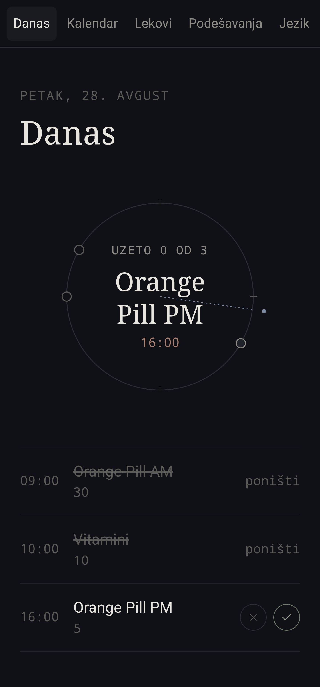
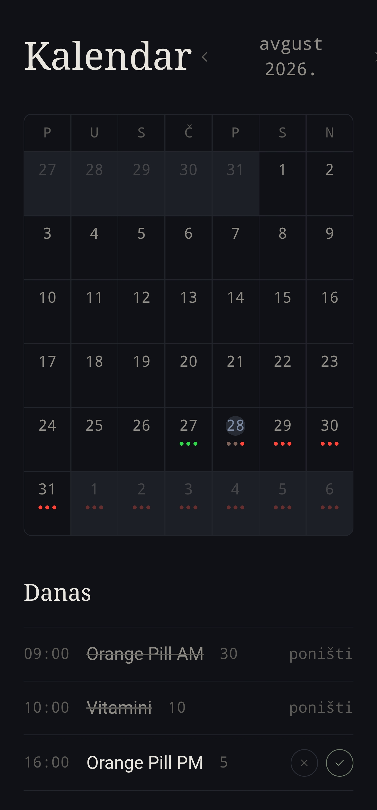
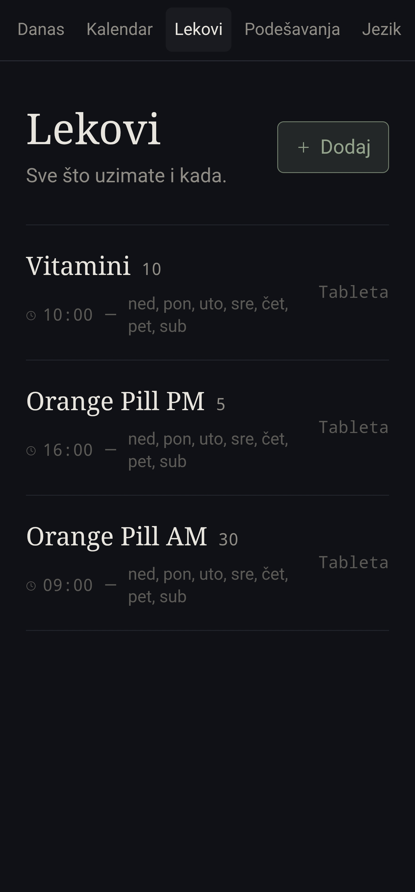
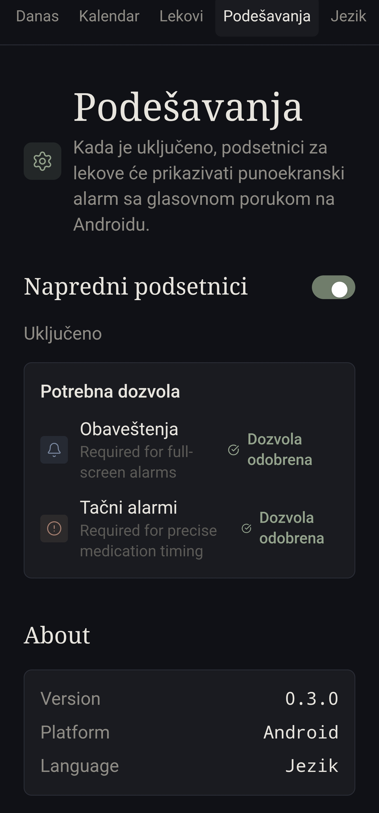
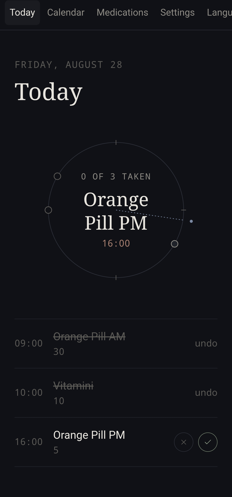
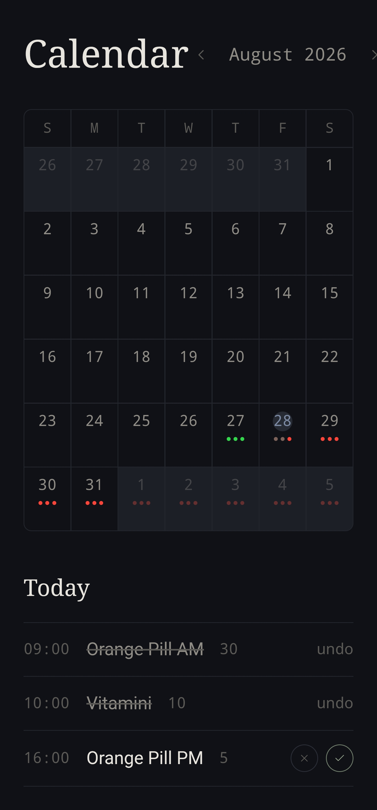
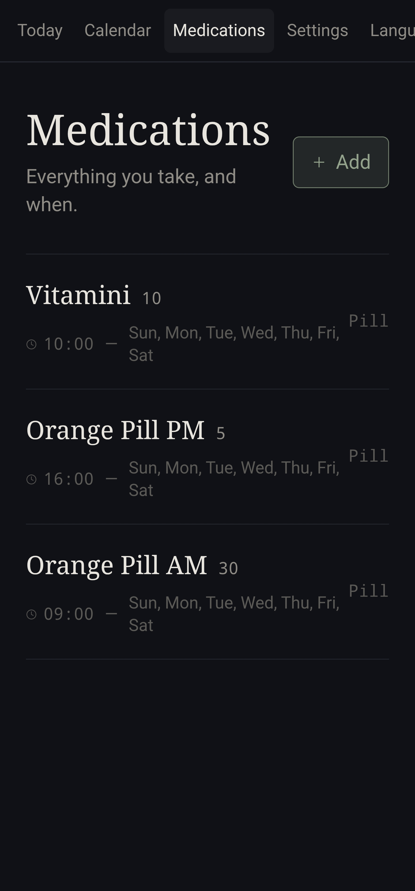
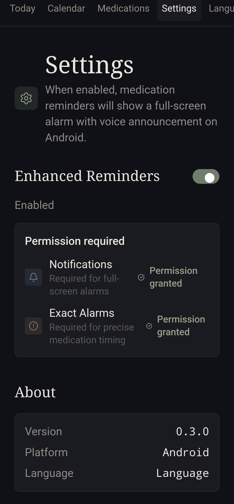

**[English](README.md) | [Srpski](README.sr.md)**

# Medtrak

Tamna, elegantna, dvojezična aplikacija za praćenje ljekova i termina kod ljekara:
upravljajte ljekovima, pregledajte ih na kalendaru i dobijajte alarme na ekranu
i preko notifikacija u pregledaču kada je vrijeme za dozu. Engleski i srpski
(latinica). Sve se čuva lokalno u pregledaču (`localStorage`)  nema servera,
naloga ni baze podataka. Možete je koristiti kao veb aplikaciju ili preuzeti
Android APK sa releases stranice.

## Screenshot-ovi

Evo kako izgleda aplikacija:

<table>
<tr>
<td></td>
<td></td>
<td></td>
<td></td>
</tr>
<tr>
<td></td>
<td></td>
<td></td>
<td></td>
</tr>
</table>

## Funkcionalnosti

- **Lekovi** — naziv, doza, oblik, jedno ili više vremena podsjetnika dnevno,
  određeni dani u nedelji (ili svaki dan), datumi početka/kraja, napomene.
- **Danas** — kružni "meridijan" prikaz koji pozicionira današnje doze prema
  vremenu u danu, plus jednostavna lista uzeto / preskočeno.
- **Termini kod lekara** — naziv, ljekar/klinika, lokacija, datum, vrijeme i
  napomene. Prikazani na kalendaru (kao tačka na dan) i u posebnoj sekciji
  na stranici Danas kada termin pada tog dana.
- **Kalendar** — prikaz po mjesecima sa malim indikatorom pridržavanja terapiji
  i tačkom za termin po danu, plus detaljna lista za izabrani dan.
- **Alarmi** — kada doza ili termin dospije, prikazuje se alarm preko cijelog
  ekrana sa blagim zvukom (generisanim u pregledaču, bez audio fajla) i, ako
  ste dali dozvolu, i nativnom notifikacijom pregledača.
- **Tamni, niskokontrastni interfejs** — namjerno prigušena paleta boja (bez
  jarkih/zasićenih akcentnih boja), serifni font za naslove, monospejs font
  za vremena i doze.

## Pokretanje lokalno

```
npm install
npm run dev
```

## Build

```
npm run build
```

Generiše potpuno statički sajt u `dist/`.

## Deploy

Ovo je statička single-page aplikacija (Vite + React), pa se deployuje na
skoro isti način svuda.
Android aplikacija se instalira uobičajenim putem preko APK fajla koji se može preuzeti sa releases stranice.

### Vercel

1. Push-ujte ovaj folder u Git repozitorijum (GitHub/GitLab/Bitbucket), ili
   pokrenite `vercel` iz ovog foldera pomoću [Vercel CLI](https://vercel.com/docs/cli).
2. Framework preset: **Vite**. Build komanda: `npm run build`. Output
   direktorijum: `dist`. Vercel sve ovo automatski prepoznaje — nije potreban
   konfiguracioni fajl.

### Cloudflare Pages

1. Push-ujte u Git repozitorijum i povežite ga u Cloudflare dashboard-u, ili
   deploy-ujte direktno preko Wrangler-a:

```
npm run build
npx wrangler pages deploy dist
```

2. Build komanda: `npm run build`. Build output direktorijum: `dist`.

### Bilo koji drugi statički hosting (Netlify, GitHub Pages, S3, itd.)

Pokrenite `npm run build` i otpremite sadržaj `dist/` foldera. To je obična
statička stranica, bez server-side koda, bez potrebnih environment
promenljivih.

## Napomene o podsetnicima

Dozvola za notifikacije pregledača se traži pri prvom učitavanju, dozvolite
je ako želite nativne OS notifikacije uz alarm unutar aplikacije. Kao i kod
svake aplikacije zasnovane na pregledaču, podsetnici rade samo dok je tab
otvoren (u prvom planu ili pozadini); ovo je ograničenje same platforme
pregledača, ne nešto što statički sajt može da zaobiđe bez push-notifikacionog
servera. Za sve što je bezbednosno kritično, tretirajte ovo kao koristan
podsetnik uz — a ne zamenu za — kutiju za ljekove ili namjenski medicinski
uređaj.

## Offline nativni podsetnici

Medtrak se takođe može upakovati kao iOS ili Android aplikacija pomoću
Capacitor-a. Nativne verzije zakazuju podsetnike direktno na uređaju, pa im
nije potreban nalog, server niti internet konekcija. Veb verzija ostaje
potpuno statička i koristi svoje postojeće alarme unutar taba.

```
# Jednom po platformi
npx cap add ios
npx cap add android

# Build veb aplikacije, kopiranje u native projekte i otvaranje IDE-a
npm run cap:ios
npm run cap:android
```

Dozvolite notifikacije kada se aplikacija otvori. Na Android 12+, uključite
sistemsku dozvolu "Alarms & reminders" za precizno zakazivanje. Android
manifest ne traži pristup internetu. Nativna aplikacija drži zakazano do 60
predstojećih podsjetnika odjednom (iOS ograničenje platforme ostavlja prostor
ispod svog maksimuma od 64); otvaranje aplikacije osvježava taj rotirajući
prozor od 30 dana nakon izmjena ili s vremenom.

## Licenca

Medtrak je objavljen pod MIT licencom.
